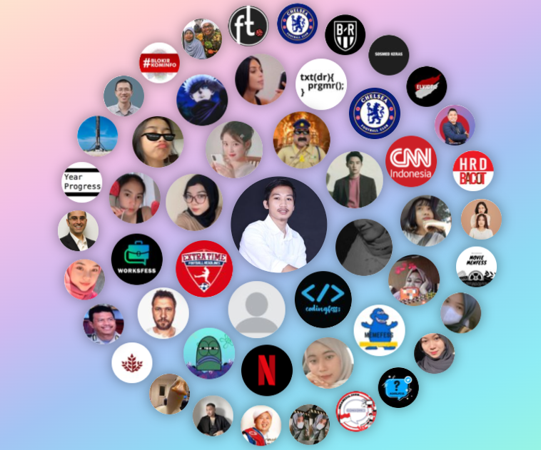

### 💻 &nbsp;Preview :
<p align="center"></p>

# My Twitter Circles with rotating animation

Originally from [My Twitter Circles](https://halip26-circles.vercel.app) it has been making the round in the dev community.
I believe this is a great opportunity for a project to learn from. 
The concept is easy and straightforward but the realization encompasses a lot of concepts.


## Installation
```shell script
git clone https://github.com/Halip26/twitter-circle.git

cd twitter-circle

```

Run with 
```shell script
open with live-server
```

### 🛠 &nbsp;Languages and Tools :

<p> 
&nbsp;
&nbsp;
&nbsp;

&nbsp;
&nbsp;
</p>

## Modifications

If you wish, you can replace the first part of the main loop in the `index.html` to use the getUser() function instead of getMe().
This will allow you to generate the circles for any public Twitter user. All the API methods used take advantage only of public data.

## Challenges

You can try to apply the following changes to test your knowledge:
- Apply a shade to  each avatar based on the most common type of interaction
- Fetch the circles for another user
- Render a grid instead of the circles

---
### 📑 &nbsp;License:

MIT License

Copyright (c) 2022 Halip26

Permission is hereby granted, free of charge, to any person obtaining a copy
of this software and associated documentation files (the "Software"), to deal
in the Software without restriction, including without limitation the rights
to use, copy, modify, merge, publish, distribute, sublicense, and/or sell
copies of the Software, and to permit persons to whom the Software is
furnished to do so, subject to the following conditions:

The above copyright notice and this permission notice shall be included in all
copies or substantial portions of the Software.

THE SOFTWARE IS PROVIDED "AS IS", WITHOUT WARRANTY OF ANY KIND, EXPRESS OR
IMPLIED, INCLUDING BUT NOT LIMITED TO THE WARRANTIES OF MERCHANTABILITY,
FITNESS FOR A PARTICULAR PURPOSE AND NONINFRINGEMENT. IN NO EVENT SHALL THE
AUTHORS OR COPYRIGHT HOLDERS BE LIABLE FOR ANY CLAIM, DAMAGES OR OTHER
LIABILITY, WHETHER IN AN ACTION OF CONTRACT, TORT OR OTHERWISE, ARISING FROM,
OUT OF OR IN CONNECTION WITH THE SOFTWARE OR THE USE OR OTHER DEALINGS IN THE
SOFTWARE.